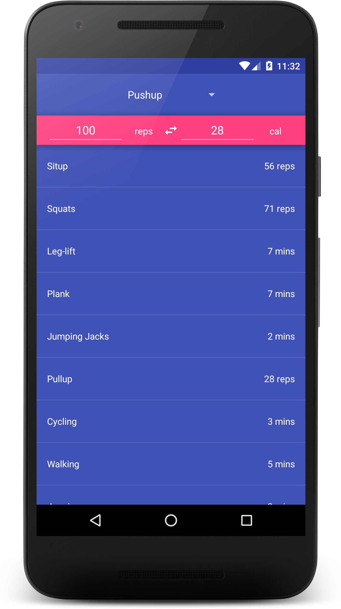
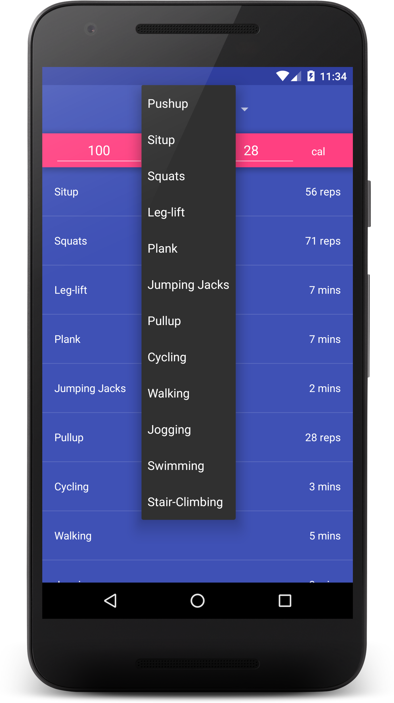
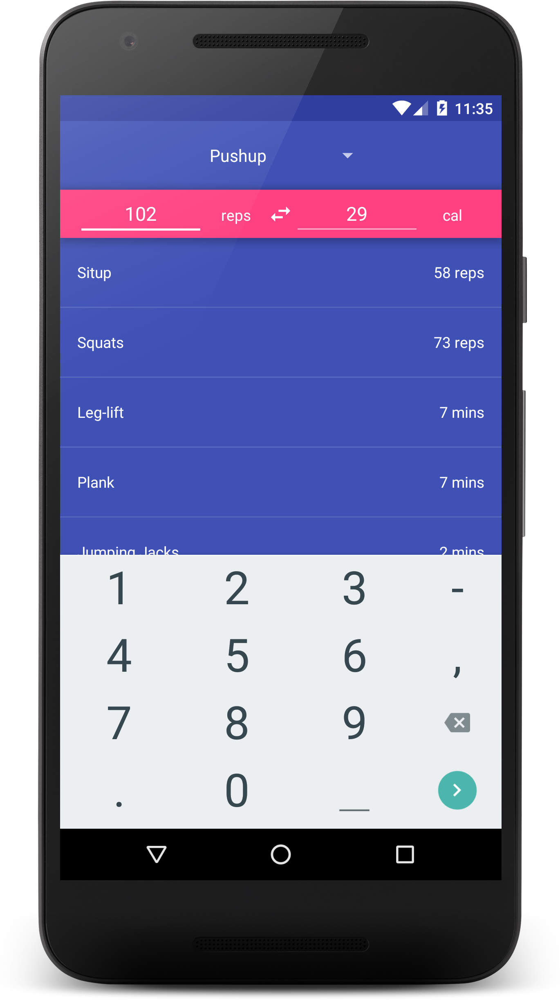
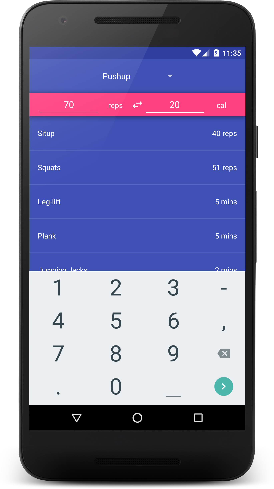
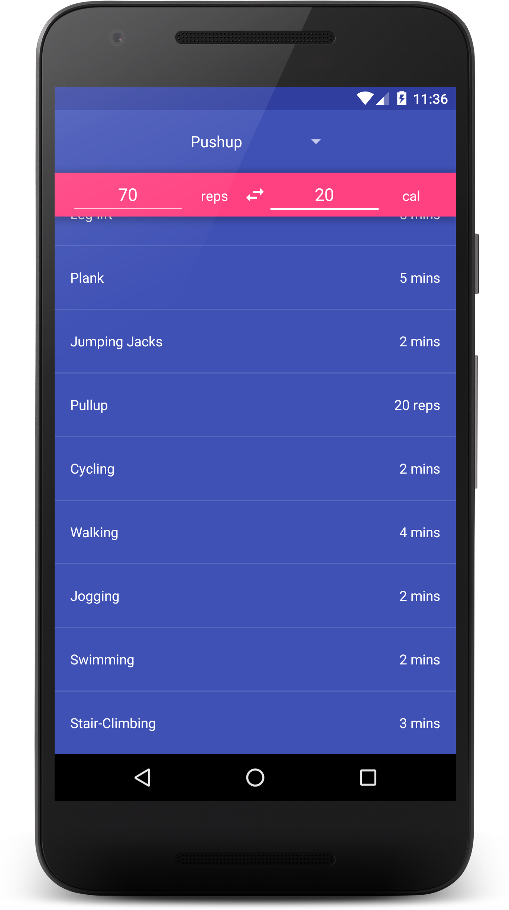

# PROG 01: Crunch Time

This app converts number of repetition or duration of an exercise to the corresponding amount of calories burned, and vice versa; at the same time, the app will also display the approximate repetition / duration for other exericses needed to achieve the same calorie goal.

The following exercises are supported:
* Pushup
* Situp
* Squats
* Leg-lift
* Plank
* Jumping Jacks
* Pullup
* Cycling
* Walking
* Jogging
* Swimming
* Stair-Climbing

## Authors

Eric Chen ([erchpito@berkeley.edu](mailto:erchpito@berkeley.edu))

## Demo Video

See [a demo of the app here] (https://link_to_your_video)

## Screenshots

